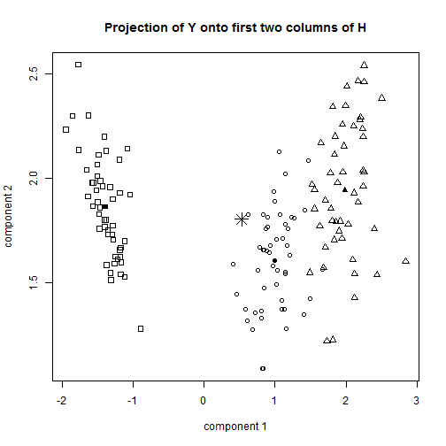
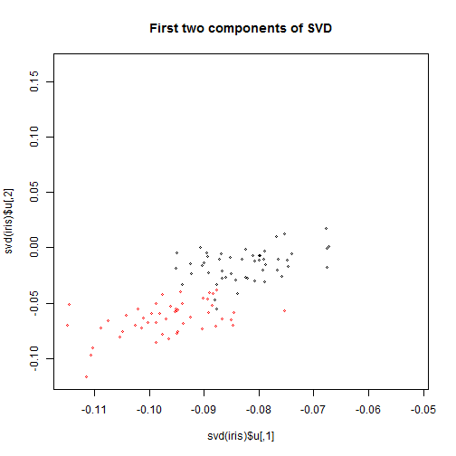

(i)

We find the estimate of the mean vector to be `

```
   SL    SW    PL    PW 
5.843 3.057 3.758 1.199 
```

.

We estimate the within-blocks covariance matrix as 

```
      SL    SW    PL    PW
SL 0.265 0.093 0.168 0.038
SW 0.093 0.115 0.055 0.033
PL 0.168 0.055 0.185 0.043
PW 0.038 0.033 0.043 0.042
```


(ii) 

Using $\lambda$ = 1 and $\theta$ = 5, we compute the predicted probabilities: 

```
  setosa versicolor virginica other
1  0.000      0.464     0.535 0.001
2  0.035      0.079     0.000 0.886
3  0.000      0.956     0.000 0.044
4  0.000      0.692     0.000 0.308
```


(iii)

We then repeat the prediction computation using $\theta$ = 7. 

```
  setosa versicolor virginica other
1  0.000      0.468     0.531 0.001
2  0.048      0.112     0.000 0.840
3  0.000      0.974     0.000 0.026
4  0.000      0.787     0.000 0.213
```


We see that our predictions are not exactly the same, but our classifications (choosing the variety with highest "probability") would not have changed. Examining the formula, we see that increasing theta has two effects: First, through the $\mu$ vector, it moves the means of the classifications away from the overall mean and towards variety-specific means. 
Secondly, it increases the variance of the "other" category term, essentially incorporating observations farther away from the overall mean as "other" with higher probability. These two effects can work against each other, empirically we see that increasing $\theta$ from 5 to 7 lowers the weight on the "other" category for all four unclassified points. 


(iv)

The eigenvalues are 
47.322, 0.42, 0, 0 

The eigenvalues are all real, and describe that the variance of the between component, adjusted by the within component, is overwhelmingly concentrated in one direction. We might imagine the following image: 

  $$
  $$  
  $$
  $$
  $$
  $$
  $$
  $$
  $$
  $$

We know that the eigevalues are all real because $S_W^{-1}S_B$ is the product of two symmetric matrices, one of which is positive semidefinite. Therefore, $S_W^{-1}S_B$ s similar to a symmetric matrix, and therefore, it has real eigenvalues. 
Similarly then, $H$, composed of the eigenvectors of $S_W^{-1}S_B$, is real. 
However, $H$ is not orthogonal is not a symmetric matrix, since real matrix $A$ has perpendicular eigenvectors if and only if $A^{T}A = AA^{T}$ and 
$$(S_W^{-1}S_B)^T S_W^{-1}S_B \neq S_W^{-1}S_B (S_W^{-1}S_B)^T$$
(verified by computation)

As far as interpretation
The first column of $H$ are the eigenvectors associated with the largest eigenvalue of $S_W^{-1}S_B$. Therefore, it represents the linear combination of features that has the largest between variance/within variance ratio. Again, check out the following picture above.

(v)
We now construct a scatterplot using the projection $YH$:

 


The overall mean is the "star" figure in the middle, and group means are the shaded-in shapes. 

The computed probability for the mean vector, with $\lambda$ = 1 and $\theta$ = 5, is:

```
  setosa versicolor virginica  other
1      0     0.9962         0 0.0038
```


We see intuitively from the plot that the predicted probability is no where near (1/3,1/3,1/3,0): The mean value lies on the  outer edge of the versicolor distribution and is classified as such.

(vi)
Using exactly the syntax that you requested:

```r
plot(svd(iris)$u, cex = 0.5, col = rep(c(0, 1, 2), each = 50), main = "First two components of SVD")
```

 


This produces a plot of the first two components of the singular value decomposition. Like the previous method, it uses linear projections to capture underlying variance. The major distinctions are that now the the linear projection components are orthogonal, and that also we are no longer adjusting for $S_W$, that is, we are no longer adjusting the variance of species by how "noisy" each species is. 

I'd guess that this makes our previous approach $S_W^{-1}S_B$ more appropriate for classification; it would be difficult to do the classifications in (v) with singular value decomposition. 

(vii)

We repeat the analysis in (ii) using the log of all measurements.


```
  setosa versicolor virginica other
1      0      0.408     0.592 0.000
2      0      0.116     0.000 0.884
3      0      0.978     0.000 0.022
4      0      0.791     0.000 0.209
```


We see that predictions are not that different, except that under the log scale, prediction of setosa is 0 for all points, in original scale there was a .04 weight on classification of setosa. I don't see any reason to prefer one over another. 

FInally, just for fun, I plot the points on the $YH$ projection plot, we see that the classifications are intuitively "good". We also gain some inference on how adjusting $\theta$ pushes points 2 and 4 from classifactions between versicolor, setosa, and the "other" category.

 


