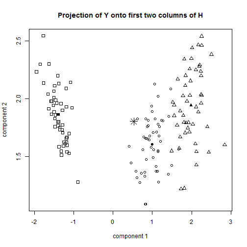
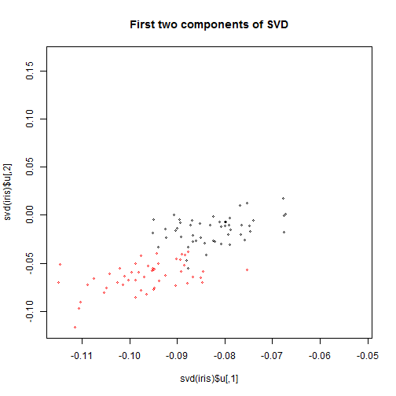
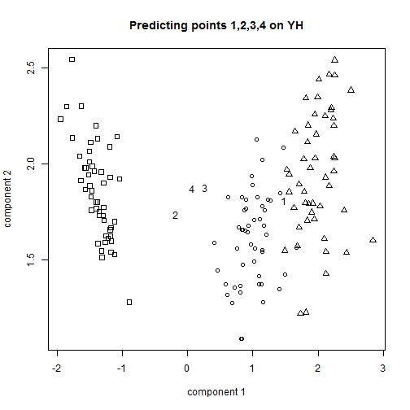

```
Warning: there is no package called 'mvtnorm'
```

```
Error: could not find function "dmvnorm"
```

```
Error: object 'res1' not found
```

```
Error: could not find function "dmvnorm"
```

```
Error: object 'res2' not found
```

 

```
Error: could not find function "dmvnorm"
```

```
Error: object 'pred_mean' not found
```

```
Error: object 'pred_mean' not found
```

 


This produces a plot of the first two components of the singular value decomposition. Like the previous method, it uses linear projections to capture underlying variance. The major distinctions are that now the the linear projection components are orthogonal, and that also we are no longer adjusting for $S_W$, that is, we are no longer adjusting the variance of species by how "noisy" each species is. 

I'd guess that this makes our previous approach $S_W^{-1}S_B$ more appropriate for classification; it would be difficult to do the classifications in (v) with singular value decomposition. 

(vii)

We repeat the analysis in (ii) using the log of all measurements.


```
  setosa versicolor virginica other
1      0      0.408     0.592 0.000
2      0      0.116     0.000 0.884
3      0      0.978     0.000 0.022
4      0      0.791     0.000 0.209
```


We see that predictions are not that different, except that under the log scale, prediction of setosa is 0 for all points, in original scale there was a .04 weight on classification of setosa. I don't see any reason to prefer one over another. 

FInally, just for fun, I plot the points on the $YH$ projection plot, we see that the classifications are intuitively "good". We also gain some inference on how adjusting $\theta$ pushes points 2 and 4 from classifactions between versicolor, setosa, and the "other" category.

 


